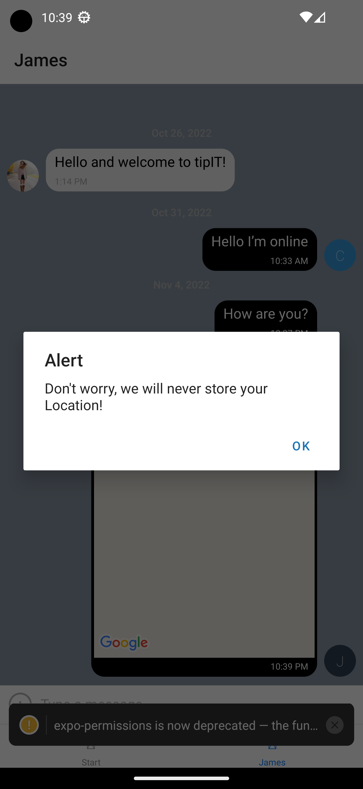

# React Native Chat App

## Tech used  
- React Native
- Expo App
- iOS
- Android Emulator
- Javascript
- StyleSheet in React Native (abstraction similar to CSS StyleSheets)
 
## Description
Chat application using React Native. The app lets the user enter a name, pick a theme color, send pictures, take photos, send their location.

## Get Started

- Clone the project
- run npm install to install all dependancies

## User Stories
- As a new user, I want to be able to easily enter a chat room
- As a user, I want to be able to send messages 
- As a user, I want to send images
- As a user, I want to share my location 
- As a user, I want to be able to read my messages offline

## Screenshots:
### Desktop

## Contact:
Christian Bork: christianbork.private@gmail.com

(<a href="#top">back to top</a>)

